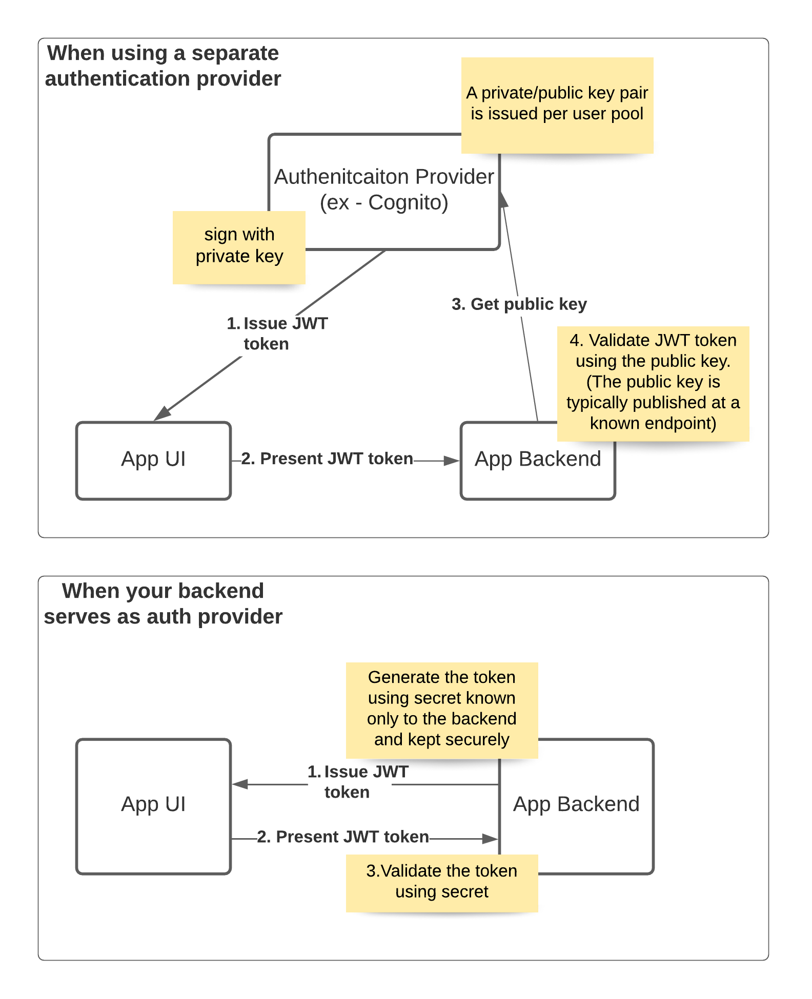

# Autolog 
Autolog is a service used to store information about the vehicles in your garage. Makes and models, as well as maintenance logs so that you can keep better track of the history of your vehicles. 

## Why?
Since I perform most of the work on my own cars, I am responsible for keeping the maintenance history. This is often a red flag to both future buyers of my cars, and any shop that has to perform maintance on the car in the future. In the past, home mechanics would keep a small notebook full of receipts in their glove compartment, serving as a log for services completed. This log, however, was easily lost, and would quite literally disentigrate over time. 

Autolog looks to fix this. 

## What? 
- A place to list and store details about your garage and the cars within it
- A place to keep vehicle service logs
- A tool to share service logs with potential future buyers or shops

Future State
- A place to list cars for sale
- A {INSERT NAME OF TERRIBLE CAR HISTORY SERVICE HERE} replacement
- Reminders for service intervals 
- Info on makes/models and maintenance 
- Insurers would love this data...I'm sure there's a correlation between maintenance and responsibility that could be tracked here. 

## Servers
- [Autolog API](./cmd/autolog-api/)
- [Auth Server](./cmd/auth/)
- [Image Server](./cmd/image/)

## Docker Compose
As a multi-container app, can run all required Servers via Docker Compose
```bash
docker compose up
```

## TODO:
- [ ] Image Server
- [ ] Auth Server 
- [ ] Headless CMS for articles (future state)
- [ ] Eventing server (future state)
- [ ] Create postgres schemas instead of one schema? 
- [ ] For self hosted - K8, especially since I'm potentially rolling out so many different servers
- [ ] DB Backup System
- [ ] Logs - Wazuh vs Greylog
- [ ] Hosting - Cloudflare tunnels for selfhosted? 
- [ ] Login with Google?
- [ ] Web App - Vue or React, knowing that I'll probably do ReactNative for Mobile?


### Auth Flow
If moving the Auth to it's own Auth server, need to switch JWT encryption to pub/priv key instead of secret string 
https://stackoverflow.com/questions/60538047/jwt-private-public-key-confusion
